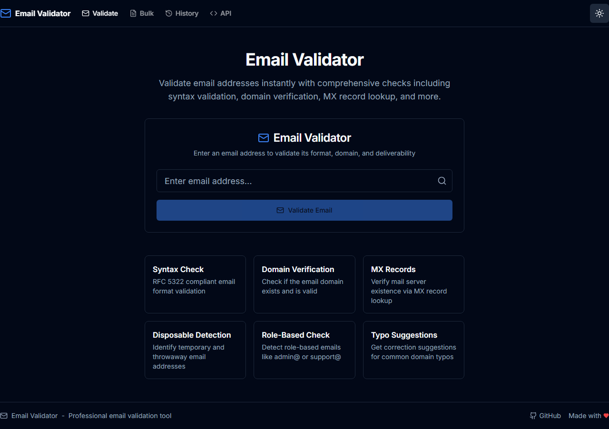
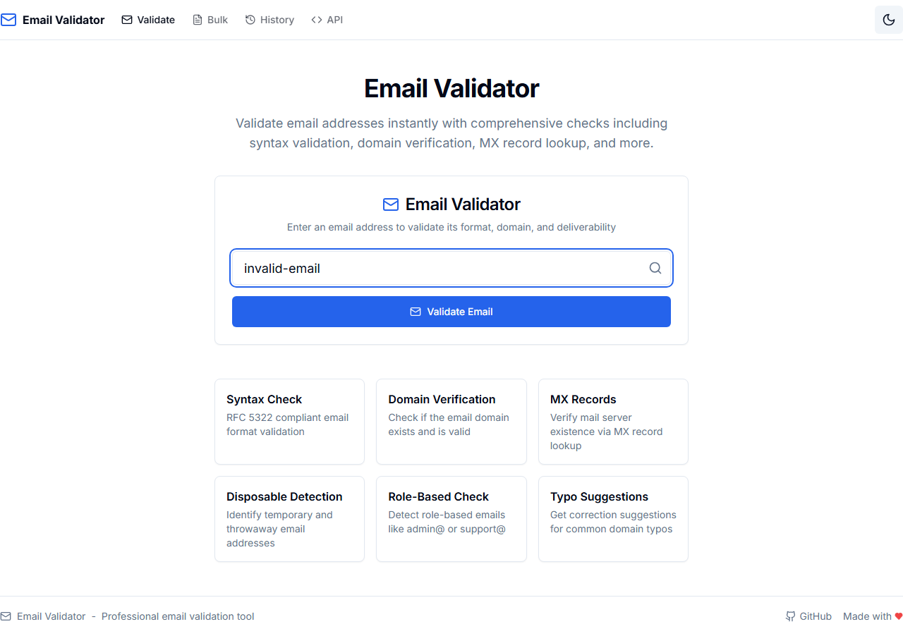
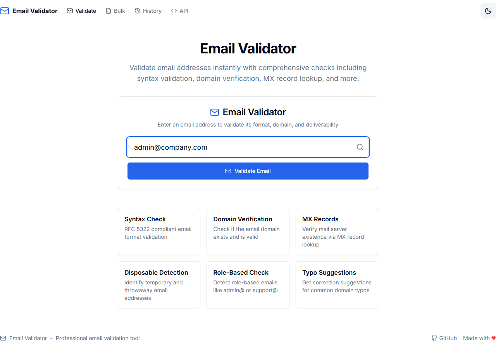
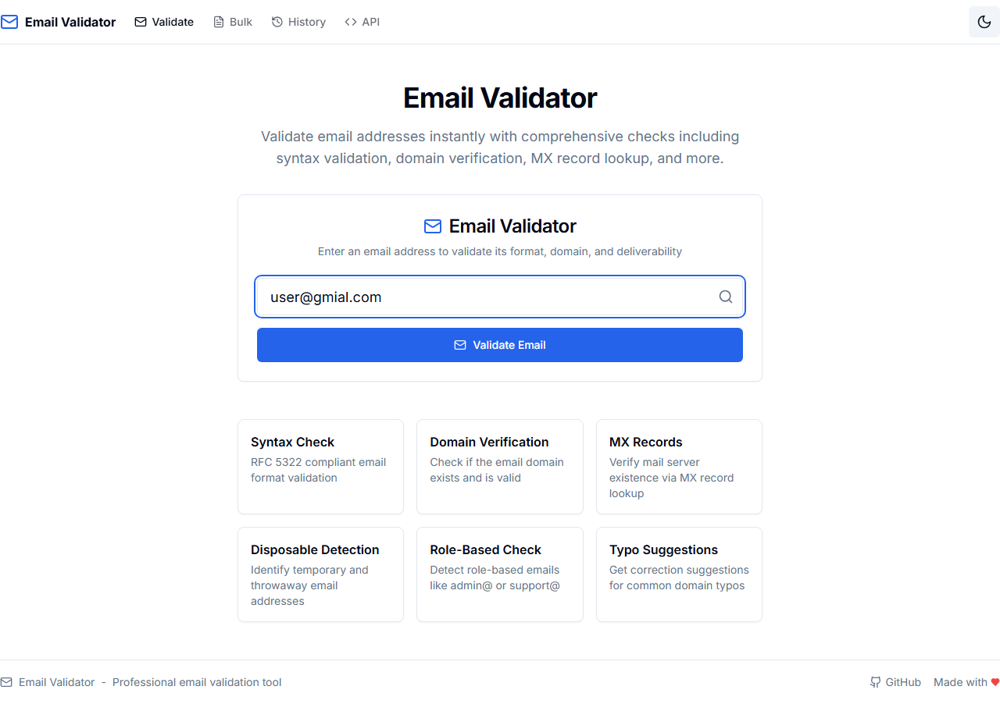
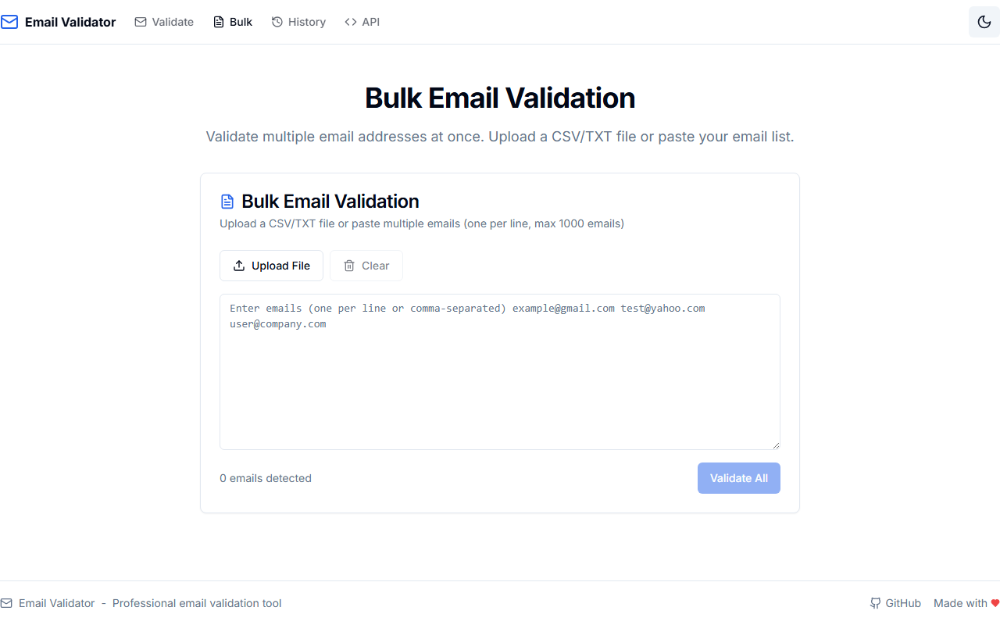
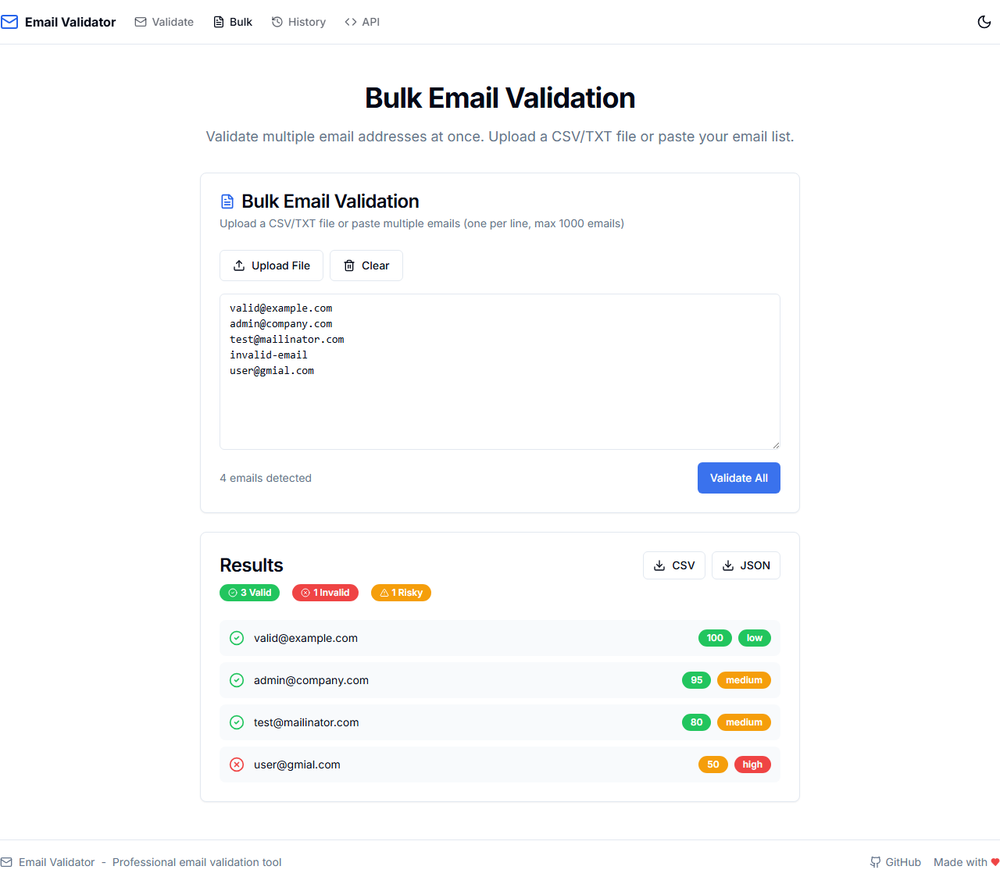
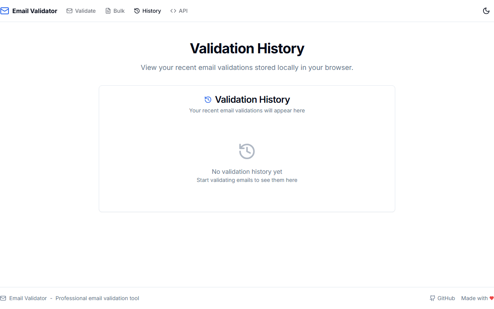
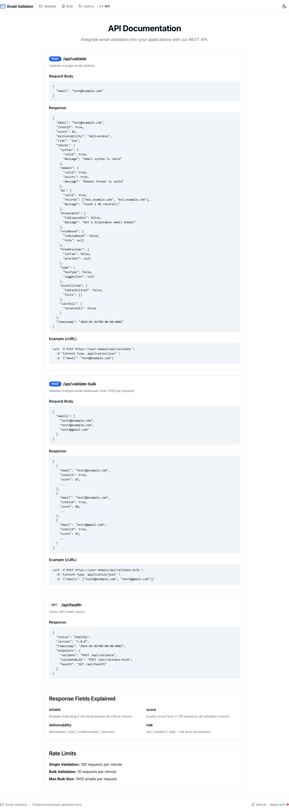

# Email Validator

A production-ready Email Validator web application built with Next.js 14, TypeScript, and Tailwind CSS. Featuring advanced validation, SMTP verification, and comprehensive API support.

## Features

### Core Validation
- **Syntax Validation** - RFC 5322 compliant email format checking
- **Domain Validation** - Check if domain exists and is valid
- **MX Record Lookup** - Verify mail server exists via DNS
- **Disposable Email Detection** - Block temporary/throwaway emails (500+ domains)
- **Role-Based Detection** - Identify emails like admin@, support@, info@
- **Free Provider Detection** - Identify Gmail, Yahoo, Outlook, etc.
- **Typo Suggestions** - Suggest corrections for common mistakes

### Advanced Validation (v2.0)
- **SMTP Verification** - Verify mailbox existence via SMTP handshake
- **DMARC/SPF/DKIM Check** - Email authentication validation
- **Domain Reputation** - Check domain reputation scores
- **Gravatar Detection** - Detect if email has associated Gravatar profile
- **Custom Blacklists** - Create and manage your own domain/email blacklists

### User Features
- Single email validation with detailed results
- Bulk validation (CSV/TXT upload or paste)
- Real-time validation as you type
- Export results to CSV or JSON
- Validation history (localStorage)
- Dark/Light mode
- Mobile responsive

### User Experience (v2.0)
- **PWA Support** - Install as app, offline functionality, push notifications
- **Internationalization** - English and Arabic with RTL support
- **Keyboard Shortcuts** - Navigate and control with keyboard (press `?` for help)
- **Email List Cleaning** - Deduplicate, normalize, and merge email lists
- **Google Contacts Import** - Import contacts directly from Google

### API & Integrations (v2.0)
- **Webhook Notifications** - Get notified on validation events
- **API Usage Dashboard** - Track and visualize API usage
- **Node.js SDK** - Official Node.js/TypeScript SDK
- **Python SDK** - Official Python SDK with async support

### API Endpoints
- `POST /api/validate` - Validate single email
- `POST /api/validate-bulk` - Validate multiple emails
- `GET /api/health` - API health check
- `POST /api/webhooks` - Manage webhooks
- `GET /api/analytics` - API usage analytics
- `GET /api/google/contacts` - Fetch Google contacts

## Screenshots

### Home Page - Single Email Validation

*Clean interface for single email validation*

### Dark Mode Support

*Full dark mode support for comfortable viewing*

### Valid Email Validation

*Detailed validation results for valid emails*

### Invalid Email Detection

*Clear feedback for syntax errors*

### Disposable Email Detection

*Detection of temporary/disposable email addresses*

### Role-Based Email Detection

*Identification of role-based email addresses*

### Typo Suggestions

*Smart suggestions for common email typos*

### Bulk Validation

*Validate multiple emails at once*

### Bulk Validation Results

*Comprehensive results for bulk validation*

### Validation History

*Track your validation history*

### API Documentation

*Built-in API documentation*

## Tech Stack

- **Framework**: Next.js 14 (App Router)
- **Language**: TypeScript (strict mode)
- **Styling**: Tailwind CSS
- **Components**: Custom components inspired by shadcn/ui
- **State Management**: Zustand
- **Animations**: Framer Motion
- **Validation**: Zod
- **Forms**: React Hook Form
- **Icons**: Lucide React
- **Testing**: Jest, React Testing Library, Playwright
- **Authentication**: NextAuth.js (Google OAuth)
- **i18n**: next-intl

## Getting Started

### Prerequisites

- Node.js 18+
- npm or yarn

### Installation

1. Clone the repository:
```bash
git clone https://github.com/mahmoodhamdi/Email-Validator.git
cd Email-Validator
```

2. Install dependencies:
```bash
npm install
```

3. Set up environment variables (optional for Google Contacts):
```bash
cp .env.example .env.local
# Edit .env.local with your Google OAuth credentials
```

4. Run the development server:
```bash
npm run dev
```

5. Open [http://localhost:3000](http://localhost:3000) in your browser.

### Build for Production

```bash
npm run build
npm start
```

## Docker

Run with Docker:

```bash
# Pull from GitHub Container Registry
docker pull ghcr.io/mahmoodhamdi/email-validator:latest

# Run the container
docker run -p 3000:3000 ghcr.io/mahmoodhamdi/email-validator:latest
```

Or use Docker Compose:

```bash
# Build and run
docker-compose up -d

# Stop
docker-compose down
```

Build locally:

```bash
# Build the image
docker build -t email-validator .

# Run the container
docker run -p 3000:3000 email-validator
```

## CLI Tool

A standalone CLI tool is available for command-line email validation:

```bash
# Install globally
npm install -g @email-validator/cli

# Or run from the cli directory
cd cli
npm install
npm run build

# Validate single email
email-validator validate test@example.com

# Validate multiple emails
email-validator validate test1@example.com test2@gmail.com

# Bulk validation from file
email-validator bulk emails.txt

# Output as JSON
email-validator validate test@example.com --format json

# Output as CSV
email-validator bulk emails.txt --format csv --output results.csv
```

### CLI Commands

| Command | Description |
|---------|-------------|
| `validate <emails...>` | Validate one or more emails |
| `bulk <file>` | Validate emails from a file (one per line) |
| `--format <type>` | Output format: `text`, `json`, or `csv` |
| `--output <file>` | Save output to file |
| `--help` | Show help |

## SDKs

### Node.js SDK

```bash
npm install @email-validator/sdk
```

```typescript
import { EmailValidator } from '@email-validator/sdk';

const validator = new EmailValidator({
  apiKey: 'your-api-key',
  baseUrl: 'https://your-domain.com'
});

// Single validation
const result = await validator.validate('test@example.com');
console.log(result.isValid, result.score);

// Bulk validation
const results = await validator.validateBulk([
  'test1@example.com',
  'test2@gmail.com'
]);

// With webhook
await validator.validate('test@example.com', {
  webhookUrl: 'https://your-webhook.com/callback'
});
```

### Python SDK

```bash
pip install email-validator-sdk
```

```python
from email_validator_sdk import EmailValidator

validator = EmailValidator(
    api_key='your-api-key',
    base_url='https://your-domain.com'
)

# Single validation
result = validator.validate('test@example.com')
print(result.is_valid, result.score)

# Bulk validation
results = validator.validate_bulk([
    'test1@example.com',
    'test2@gmail.com'
])

# Async support
import asyncio
from email_validator_sdk import AsyncEmailValidator

async def main():
    async with AsyncEmailValidator(api_key='your-api-key') as validator:
        result = await validator.validate('test@example.com')
        print(result)

asyncio.run(main())
```

## Postman Collection

Import our Postman collection for easy API testing:

1. Download the collection from `postman/email-validator.postman_collection.json`
2. Import into Postman
3. Set up environment variables:
   - `baseUrl`: Your API base URL
   - `apiKey`: Your API key (if required)

The collection includes:
- All API endpoints with examples
- Pre-request scripts for authentication
- Test scripts for response validation
- Environment variable templates

## Keyboard Shortcuts

Press `?` anywhere to see all available keyboard shortcuts.

| Shortcut | Action |
|----------|--------|
| `?` | Show shortcuts help |
| `Ctrl + K` | Focus search/input |
| `Ctrl + Enter` | Submit validation |
| `Ctrl + B` | Go to bulk validation |
| `Ctrl + H` | Go to history |
| `Ctrl + D` | Toggle dark mode |
| `Escape` | Close modals |

## Internationalization

The app supports multiple languages:

- **English** (default)
- **Arabic** (with RTL support)

Toggle language from the header. Language preference is persisted.

## PWA Features

Install the app on your device:

1. Open in browser
2. Click "Install" when prompted (or use browser menu)
3. Access offline functionality
4. Receive push notifications for webhooks

## CI/CD

This project uses GitHub Actions for continuous integration and deployment:

- **CI Pipeline**: Runs on every push and PR
  - Linting and type checking
  - Unit tests with coverage
  - E2E tests with Playwright
  - Build verification

- **Docker Pipeline**: Runs on push to main
  - Builds multi-architecture images (amd64, arm64)
  - Pushes to GitHub Container Registry
  - Pushes to Docker Hub (if configured)

- **Release Pipeline**: Runs on version tags
  - Creates GitHub releases
  - Generates changelog

## Testing

This project includes comprehensive tests:

### Unit Tests
Unit tests cover all validators, hooks, and stores.

```bash
# Run all unit tests
npm test

# Run tests in watch mode
npm run test:watch

# Run tests with coverage
npm run test:coverage
```

### Integration Tests
Integration tests verify API routes work correctly.

```bash
# Integration tests are included in the main test suite
npm test
```

### E2E Tests
End-to-end tests using Playwright verify the complete user experience.

```bash
# Install Playwright browsers (first time only)
npx playwright install

# Run E2E tests
npm run test:e2e

# Run E2E tests with UI
npm run test:e2e:ui
```

### Test Coverage

| Category | Tests | Status |
|----------|-------|--------|
| Validators | 196+ | ✅ Passing |
| Hooks | 20+ | ✅ Passing |
| Stores | 15+ | ✅ Passing |
| API Routes | 25+ | ✅ Passing |
| Components | 100+ | ✅ Passing |
| E2E | 20+ scenarios | ✅ Passing |

## API Usage

### Single Email Validation

```bash
curl -X POST https://your-domain/api/validate \
  -H "Content-Type: application/json" \
  -d '{"email": "test@example.com"}'
```

### Bulk Email Validation

```bash
curl -X POST https://your-domain/api/validate-bulk \
  -H "Content-Type: application/json" \
  -d '{"emails": ["test1@example.com", "test2@gmail.com"]}'
```

### With SMTP Verification

```bash
curl -X POST https://your-domain/api/validate \
  -H "Content-Type: application/json" \
  -d '{"email": "test@example.com", "smtp": true}'
```

## Response Format

```json
{
  "email": "test@example.com",
  "isValid": true,
  "score": 85,
  "deliverability": "deliverable",
  "risk": "low",
  "checks": {
    "syntax": { "valid": true, "message": "Email syntax is valid" },
    "domain": { "valid": true, "exists": true, "message": "Domain format is valid" },
    "mx": { "valid": true, "records": ["mx1.example.com"], "message": "Found 1 MX record(s)" },
    "disposable": { "isDisposable": false, "message": "Not a disposable email domain" },
    "roleBased": { "isRoleBased": false, "role": null },
    "freeProvider": { "isFree": false, "provider": null },
    "typo": { "hasTypo": false, "suggestion": null },
    "smtp": { "valid": true, "message": "Mailbox exists" },
    "authentication": {
      "spf": true,
      "dmarc": true,
      "dkim": true,
      "score": 100
    },
    "reputation": { "score": 95, "status": "good" },
    "gravatar": { "hasGravatar": true, "profileUrl": "..." }
  },
  "timestamp": "2024-01-01T00:00:00.000Z"
}
```

## Project Structure

```
src/
├── app/                    # Next.js App Router pages
│   ├── api/               # API routes
│   │   ├── validate/      # Email validation
│   │   ├── webhooks/      # Webhook management
│   │   ├── analytics/     # Usage analytics
│   │   └── google/        # Google contacts
│   ├── bulk/              # Bulk validation page
│   ├── history/           # History page
│   ├── api-docs/          # API documentation page
│   ├── tools/             # Tools (list cleaning)
│   └── import/            # Import (Google contacts)
├── components/
│   ├── ui/                # UI components (button, input, card, etc.)
│   ├── email/             # Email validation components
│   ├── layout/            # Layout components (header, footer)
│   ├── cleaning/          # List cleaning components
│   ├── google/            # Google integration components
│   ├── shortcuts/         # Keyboard shortcuts components
│   ├── webhooks/          # Webhook management components
│   └── providers/         # Context providers
├── lib/
│   ├── data/              # Data files (disposable domains, etc.)
│   ├── validators/        # Validation logic
│   ├── cleaning/          # List cleaning logic
│   ├── google/            # Google API integration
│   ├── auth/              # Authentication configuration
│   └── i18n/              # Internationalization
├── hooks/                 # Custom React hooks
├── stores/                # Zustand stores
├── types/                 # TypeScript types
└── messages/              # Translation files
    ├── en.json
    └── ar.json
cli/                       # Standalone CLI tool
postman/                   # Postman collection
sdk/                       # SDK packages
├── nodejs/
└── python/
```

## Environment Variables

```bash
# Required for Google Contacts Import
GOOGLE_CLIENT_ID=your-google-client-id
GOOGLE_CLIENT_SECRET=your-google-client-secret
NEXTAUTH_SECRET=your-nextauth-secret
NEXTAUTH_URL=http://localhost:3000

# Optional
SMTP_TIMEOUT=5000
REPUTATION_API_KEY=your-api-key
```

## Version History

- **v2.0.0** - Advanced validation, APIs, SDKs, PWA, i18n, and more
- **v1.0.0** - Initial release with core validation features

## License

This project is licensed under the MIT License - see the [LICENSE](LICENSE) file for details.

## Author

**Mahmood Hamdi**

- GitHub: [@mahmoodhamdi](https://github.com/mahmoodhamdi)
- Email: mwm.softwars.solutions@gmail.com
- Email: hmdy7486@gmail.com
- Phone: +201019793768

## Contributing

Contributions are welcome! Please feel free to submit a Pull Request.

1. Fork the project
2. Create your feature branch (`git checkout -b feature/AmazingFeature`)
3. Commit your changes (`git commit -m 'Add some AmazingFeature'`)
4. Push to the branch (`git push origin feature/AmazingFeature`)
5. Open a Pull Request

## Support

If you have any questions or need help, feel free to reach out via email or open an issue on GitHub.
